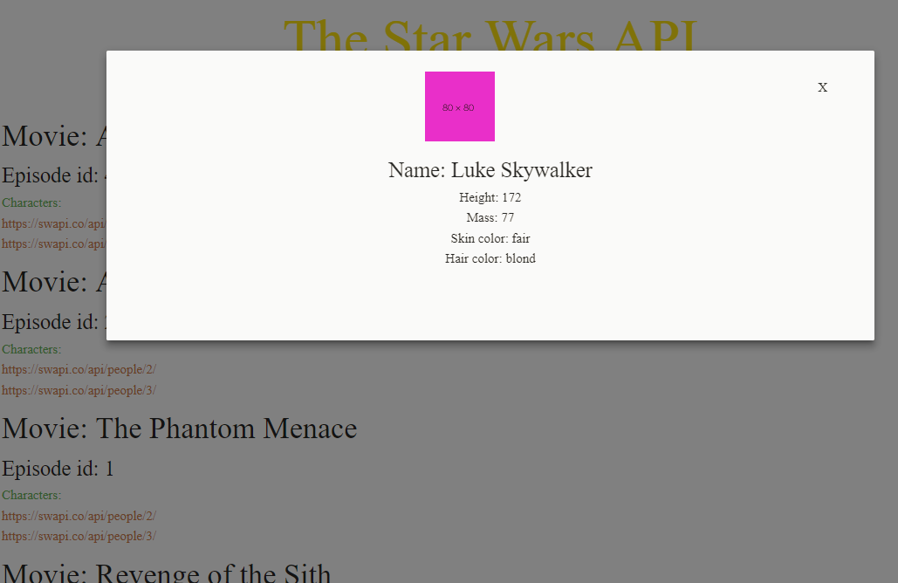
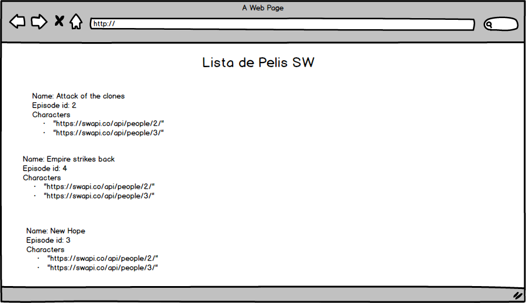
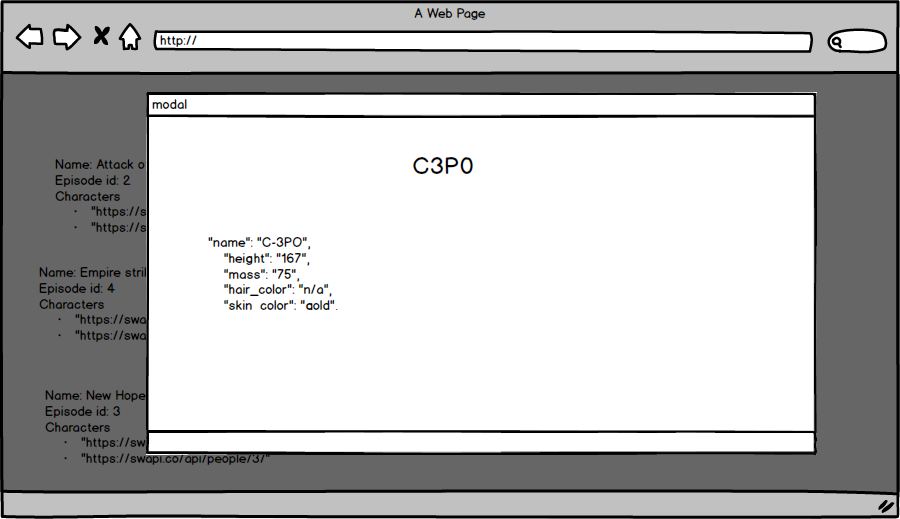

# SWAPI
***
## Descripción:
Web page en la que se hace consumo de la API de StarWars, en este sitio los fanáticos pueden explorar la información de los episodios o personajes favoritos.

## Desarrollado para [Laboratoria](http://www.laboratoria.la/)

## Previo al código
1. Acceso a todas las pelis en este [endpoint](https://swapi.co/api/films/1/?format=json).

2. Imprimir Nombre, Episodio y Personajes.

3. Le doy click a la URL de un personaje y me abre un modal.

4. En el modal se muestra Nombre, peso, massa, color de pelo y color de piel de **cada** personaje.

## En este proyecto se aplican los siguientes conceptos
- Uso de fetch.

- Uso de modales con información dinámica.

